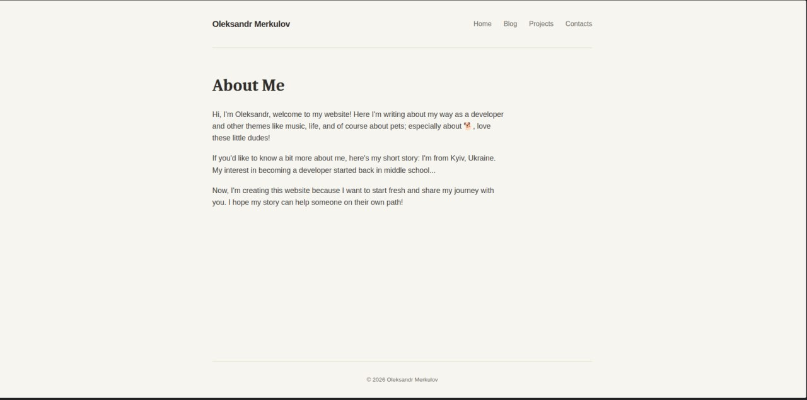
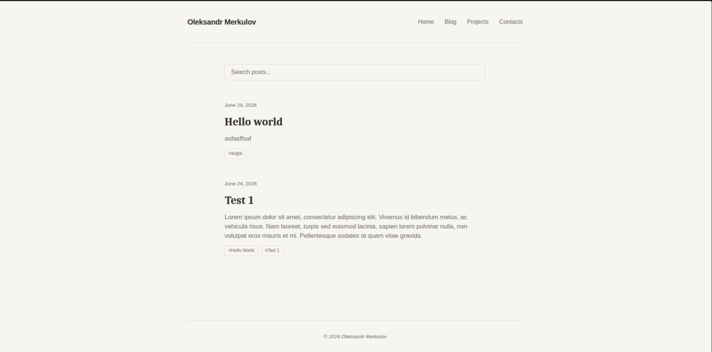
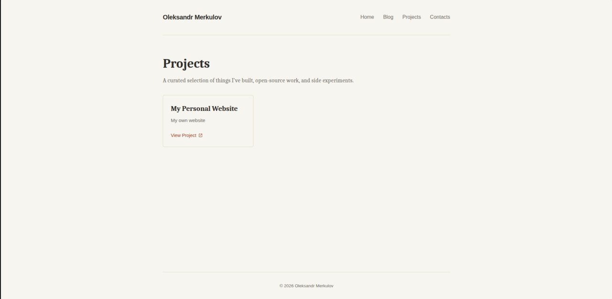

# Personal Portfolio & Blog Website

A clean, minimalist personal website, portfolio, and modular blog application built from scratch using **Django** and **PostgreSQL**. The project features an elegant, single-column reading flow, an interactive tag-filtering/search engine, and a flexible chapter-based content system designed for high backend customizability.

## 📸 Screenshots

| Home Page / About | Blog Feed (Filtered) | Project Matrix |
|---|---|---|
|  |  |  |

*(Place your images inside a `./docs/screenshots/` directory or update paths accordingly)*

---

## ✨ Features

* **Minimalist Architecture:** Translucent design tokens, optimized serif-based typography hierarchies for readability, and native responsive layouts.
* **Modular Chapter-Based Engine:** Content isn't confined to a single massive textarea. Articles are split into sequential, reorderable `PostChapter` nodes supporting dynamic subtitle, text, and media uploads.
* **Smart URL State Management:** Contextual backend search and tag-filtering execution using compound query strings (`?tag=python&q=query`).
* **Persistent Filter Navigation:** Typographic header tracking displaying active filter constraints with a one-click default reset capability.
* **Projects Grid Dashboard:** Minimal, hover-interactive portfolio component to display professional developments, repositories, and case studies.

---

## 🛠️ Tech Stack & Utilities

* **Framework:** Django (Python 3.13+)
* **Database:** PostgreSQL
* **Package & Environment Management:** [uv](https://github.com/astral-sh/uv) (Fast Python package installer and resolver)
* **Ordering Mixins:** `django-adminsortable2` (For managing chapter sequence arrays)

---

## 🚀 Local Development Setup

### 1. Prerequisites
Ensure you have `uv` installed on your machine:
```bash
# On macOS/Linux
curl -LsSf [https://astral-sh.uv.run/install.sh](https://astral-sh.uv.run/install.sh) | sh

### 2. Clone the Repository
git clone [https://github.com/oleksandrmerkuloff/PersonalWebsiteProject.git](https://github.com/oleksandrmerkuloff/PersonalWebsiteProject.git)
cd PersonalWebsiteProject

### 3. Setup Your Environment Variables
Create a .env file in the project root folder to map your local PostgreSQL database credentials securely:
DEBUG=True
SECRET_KEY=your-dev-secret-key
DB_NAME=your_db_name
DB_USER=your_db_user
DB_PASSWORD=your_db_password
DB_HOST=localhost
DB_PORT=5432

### 4. Install Dependencies & Synchronize Database
Use uv to automatically provision a virtual environment, compile your environment tracking files, generate schemas, and run migrations:

# Generate and apply schemas
uv run python manage.py makemigrations
uv run python manage.py migrate

# Create your admin user profile dashboard access
uv run python manage.py createsuperuser

### 5. Run the Local Development Server
uv run python manage.py runserver
Navigate to http://127.0.0.1:8000/ in your browser to inspect your local node stream!
